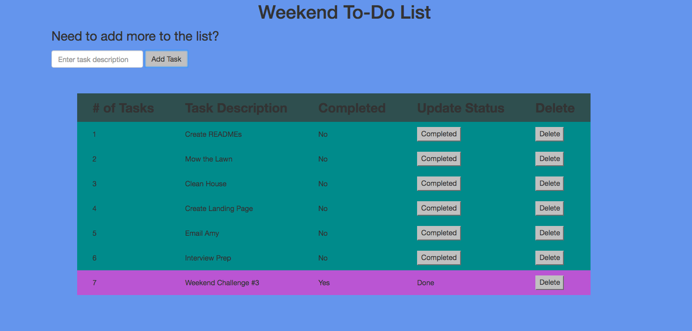

# To Do Application



This weekend challenge was our first Full Stack web application. CRUD routes are starting be explored. We learned to Create, Read and Delete records from the database.

We started playing with logic and queries to return the data in a preferred order.


## Getting Started

These instructions will get you a copy of the project up and running on your local machine for development and testing purposes.

### Prerequisites

You will need to have the following software installed.

```
Node.js (https://nodejs.org/en/)
```

```
PostgreSql (https://launchschool.com/blog/how-to-install-postgresql-on-a-mac)
```

```
Postico (https://eggerapps.at/postico/)
```

### Installing

Steps to get the development environment running.

1. Clone the repository to your local machine.

```
git clone https://github.com/BetsyRowley/weekendChallenge3.git
```

2. Install all dependencies.

```
npm install
```

3. Ensure PostgreSql is running.

```
brew services start postgresql
```

4. Spin up the Server.

```
npm start
```

5. Open in the browser.

```
localhost:8000
```

## Built With

* PostgreSql
* Express.js
* jQuery
* Node.js
* HTML5
* CSS3
* Bootstrap


## Authors

* [**Betsy Rowley**](https://github.com/BetsyRowley)

## Acknowledgments

* Prime Digital Academy Instructors Chris Black and Scott Bromander for their on-going support.
